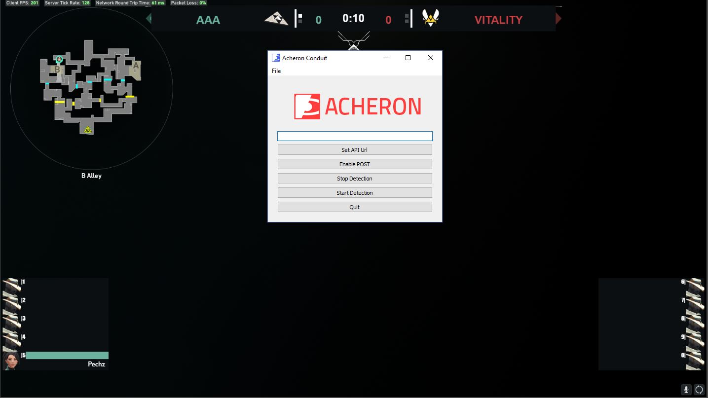

# Acheron

This product is aimed at improving the viewing experience in Valorant by providing data that can be used to create a custom HUD that can be integrated to a live broadcast.

It is using computer vision to gather information on the game (hp of the players, round time, and scores).

Only a bandaid until Riot releases a better way to do this (local telemetry data, game API, spectator API...)

## Example

## Running Acheron
- python AcheronObs.py
- java -jar acheron_overlay.jar

You need to create a 'config.json' file, see acheron.py to see what's needed.

<form action="https://www.paypal.com/cgi-bin/webscr" method="post" target="_top">
<input type="hidden" name="cmd" value="_s-xclick" />
<input type="hidden" name="hosted_button_id" value="XYYFJQKB5JGHJ" />
<input type="image" src="https://www.paypalobjects.com/en_US/i/btn/btn_donate_SM.gif" border="0" name="submit" title="PayPal - The safer, easier way to pay online!" alt="Donate with PayPal button" />

</form>

Thanks for supporting !
